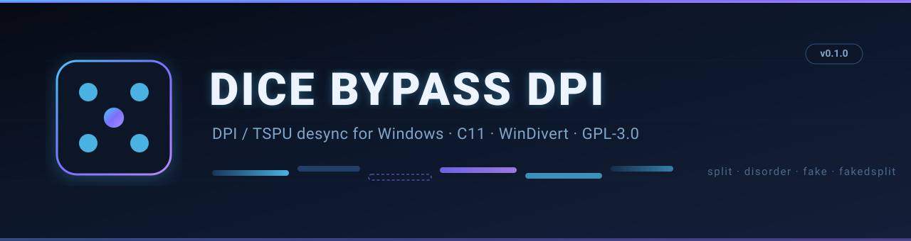
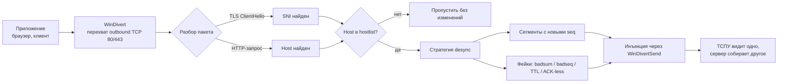

<div align="center">
  
</div>

<div align="center">

[](https://github.com/user/dbdpi/actions/workflows/build.yml)
[](LICENSE)


</div>

---

**Dice Bypass DPI (dbdpi)** — консольный инструмент обхода DPI/ТСПУ для Windows
в стиле [zapret](https://github.com/bol-van/zapret) и
[GoodbyeDPI](https://github.com/ValdikSS/GoodbyeDPI), написанный с нуля на C
поверх [WinDivert](https://reqrypt.org/windivert.html). Без драйверов, без
VPN, без прокси: только работа с тем, как ТСПУ видит ваш TCP-поток.

Инструмент перехватывает исходящие TCP-пакеты на портах 80/443, распознаёт
HTTP-запросы и TLS ClientHello (SNI) и «рассинхронизирует» DPI:

- **режет** первый пакет так, чтобы сигнатуру домена нельзя было собрать;
- **отправляет фейковые пакеты**, которые ТСПУ видит, а сервер — нет;
- **меняет порядок** сегментов и делает HTTP-трюки с заголовками.

Работает только с теми доменами, что перечислены в hostlist, поэтому банки,
госуслуги и всё остальное остаются нетронутыми.

---

## 📋 Возможности

| Категория | Описание |
|:---|:---|
| **Стратегии** | `split`, `multisplit`, `disorder`, `fake`, `fakedsplit` |
| **Позиции разреза** | числа и маркеры: `method`, `host`, `endhost`, `midsld`, `sni`, `sniext` |
| **Фейк-пакеты** | встроенный браузерный ClientHello (`--fake-gen`), загрузка из файла (raw/hex), `--repeats` |
| **Инвалидация фейков** | `badsum`, `badseq`, `ttl` (+ `autottl` по длине пути до сервера), `datanoack` |
| **HTTP-трюки** | `--hostcase`, `--hosttab`, `--methodeol` |
| **Списки доменов** | whitelist (`--hostlist`) и исключения (`--hostlist-exclude`), с поддоменами |
| **Сеть** | IPv4 + IPv6, лёгкий conntrack, обработка ретрансмиссий первого сегмента |
| **Эксплуатация** | режим Windows-службы, `.bat`-профили, `blockcheck` для автоподбора, файл-лог, `--selftest` без прав администратора |

---

## 🔄 Как это работает



### Стратегии

| Стратегия | Принцип |
|:---|:---|
| **split / multisplit** | ClientHello режется на сегменты в выбранных позициях. DPI не видит домен; серверу сегменты приходят по порядку. |
| **disorder** | То же, но сегменты уходят в обратном порядке: DPI не может собрать последовательность, TCP-стек сервера — может. |
| **fake** | Перед настоящим пакетом — фейковый ClientHello с тем же SNI. Фейк инвалидирован, до сервера не доходит, а ТСПУ «проглатывает» его и рассинхронизируется. |
| **fakedsplit** | fake + split вместе: фейк перед каждым сегментом. |
| **autottl** | По TTL входящего SYN-ACK определяется длина пути до сервера; TTL фейка ставится так, чтобы он умер после ТСПУ, но до сервера. |

---

## 🚀 Быстрый старт

**Требования:** Windows 10/11 x64 · права администратора (WinDivert — драйвер) · mingw-w64 для сборки.

```cmd
:: 1. Собрать (WinDivert уже в комплекте; компилятор — в tools\mingw64 или в PATH)
build.cmd

:: 2. Проверить себя без прав администратора — 15 проверок парсеров и движка
bin\dbdpi.exe --selftest

:: 3. Запустить профиль (сам запросит UAC)
profiles\fake-split.bat

:: ...или напрямую
bin\dbdpi.exe --preset=4 --hostlist=lists\hostlist.txt --debug
```

Если mingw-w64 нет, `tools\download_mingw.cmd` скачает портативный winlibs
в `tools\mingw64`.

### Готовые профили

> Все профили сами запрашивают UAC и используют hostlist.

| Профиль | Что делает |
|:---|:---|
| `profiles\youtube-discord.bat` | multisplit по `midsld` + hostlist — универсальный лёгкий |
| `profiles\fake-split.bat` | пресет 4: fake + split + badsum/badseq — обычно самый рабочий |
| `profiles\fake-ttl.bat` | fake, убитый по TTL (autottl) — когда badsum/badseq фильтруют |
| `profiles\disorder.bat` | disorder без фейков — минимальное вмешательство |

---

## 🎯 Пресеты

| № | Стратегия | Когда использовать |
|:---:|:---|:---|
| 1 | multisplit в середине SLD | универсальный лёгкий — начните с него |
| 2 | multisplit: `method`+`host`+`endhost` | HTTP-ориентированный (порт 80) |
| 3 | disorder по `midsld` | когда split не работает |
| 4 | fakedsplit + fake-gen + badsum/badseq | **обычно самый рабочий** |
| 5 | только fake ×2 + badsum/badseq | когда split ломает что-то |
| 6 | disorder по началу SNI extension | альтернативный disorder |

---

## 🔍 Подбор стратегии под вашего провайдера

ТСПУ ведёт себя по-разному в разных регионах и у разных провайдеров.
`tools\blockcheck.cmd` (запросит UAC) прогонит все 6 пресетов против тестового
URL и напишет, какой работает. Рабочий пресет пропишите в профиль или в
`service\service.args`.

---

## 🔧 Служба Windows

```cmd
service\service_install.cmd   :: установит службу DBDPI и запустит её
service\service_remove.cmd    :: удалит
```

Аргументы стратегии — в `service\service.args` (генерируются при установке с
абсолютными путями), после правки: `net stop DBDPI && net start DBDPI`.
Лог службы: `bin\dbdpi-service.log`.

---

## ⚙️ Опции

```
--wf-tcp=80,443          порты перехвата (по умолчанию 80,443)
--dpi-desync=MODE        split | multisplit | disorder | fake | fakedsplit
--split-pos=POS[,POS]    позиция: число или маркер
                         (method, host, endhost, midsld, sni, sniext)
--hostlist=FILE          обрабатывать только домены из файла (+ поддомены)
--hostlist-exclude=FILE  никогда не обрабатывать домены из файла
--fake-gen               встроенный браузерный ClientHello
--fake-tls=FILE          фейк из файла (raw или hex)
--fake-http=FILE         фейк HTTP-запроса из файла
--fooling=LIST           инвалидация: badsum,badseq,ttl,datanoack,none
--ttl=N                  фиксированный TTL фейка
--autottl=D:M-X          авто-TTL по длине пути (по умолчанию 3:3-64)
--repeats=N              копий каждого фейка
--badseq=N               seq-дельта для badseq-фейков (по умолчанию -100000)
--hostcase / --hosttab / --methodeol    HTTP-трюки (та же длина пакета)
--wsize=N                переписать окно в исходящем SYN
--max-payload=N          не трогать сегменты длиннее N (по умолчанию 8192)
--preset=N               готовые наборы 1..6
--config=FILE            загрузить опции из файла (формат как service.args)
--dry-run                логировать решения desync без модификации пакетов
--timeout=N              автоматический выход через N секунд
--log=FILE / --debug     лог в файл / подробный лог
--service-run=ARGFILE    запуск как службы (используется SCM)
--install-service=ARGFILE / --remove-service
--selftest               встроенные тесты
--version | --help
```

> **Полезные предупреждения** выводятся при старте: `fake` без `--fooling`
> (фейки не инвалидированы и могут дойти до сервера) и `--fooling=ttl` без
> `--ttl`/`--autottl` (TTL неизвестен — фейки будут пропущены).

---

## 📊 Что видно в логе

```text
2026-10-02 15:18:23.100 filter: tcp and (outbound and (tcp.DstPort == 80 or tcp.DstPort == 443) or inbound and (tcp.SrcPort == 80 or tcp.SrcPort == 443) and tcp.Syn == 1 and tcp.Ack == 1)
2026-10-02 15:18:23.351 hostlist D:\GDPI\lists\hostlist.txt: 24 domains loaded
2026-10-02 15:18:24.902 tcp4 51422->443 tls: host=www.youtube.com
2026-10-02 15:18:24.903 desync: injecting 2 packets (mode 4)
2026-10-02 15:18:24.905 autottl: path len to server = 9
2026-10-02 15:19:24.100 stats: total=142 desync=8 pass=134 hostmiss=127
```

Каждые 60 секунд в лог пишется строка `stats:` со счётчиками обработанных
пакетов. Hostlist проверяется на изменения каждые 30 секунд и перезагружается
автоматически (горячая перезагрузка).

---

## ❓ FAQ

<details>
<summary><b>Антивирус ругается на WinDivert64.sys</b></summary>

Это ожидаемо: подписанный драйвер перехвата пакетов, эвристики AV его не любят.
Файл взят из официального дистрибутива WinDivert 2.2.2-A. Добавьте папку `bin\`
в исключения антивируса.
</details>

<details>
<summary><b>Не заработало</b></summary>

Запустите `tools\blockcheck.cmd` — он переберёт пресеты и скажет, какой работает
у вашего провайдера. Смотрите лог с `--debug`.
</details>

<details>
<summary><b>Конфликтует с zapret / GoodbyeDPI</b></summary>

Да, одновременно нельзя: оба используют WinDivert. Запускайте что-то одно.
</details>

<details>
<summary><b>Discord-voice / QUIC не работает</b></summary>

UDP/QUIC пока не обрабатывается. Инструмент работает только с TCP 80/443.
Поддержка QUIC запланирована в v2.
</details>

<details>
<summary><b>Сайт не в списке — он не обрабатывается</b></summary>

Это by design: по умолчанию стратегия применяется только к доменам из
`lists\hostlist.txt`. Без hostlist стратегия применяется ко всем сайтам на
этих портах. Добавьте нужный домен в файл — он подхватится автоматически
в течение 30 секунд (горячая перезагрузка).
</details>

<details>
<summary><b>Как использовать конфиг-файл вместо длинной командной строки?</b></summary>

`--config=FILE` загружает опции из файла (формат — по одному аргументу на
строку, тот же что `service\service.args`). CLI-аргументы дополняют конфиг:

```cmd
bin\dbdpi.exe --config=my.conf --debug
```
</details>

<details>
<summary><b>Как проверить, что будет обработано, не ломая трафик?</b></summary>

`--dry-run` — логирует все решения desync (какие пакеты были бы модифицированы),
но отправляет оригинальные пакеты без изменений.
</details>

---

## ⚠️ Ограничения (честно)

- Не обходит: блокировку по IP, DNS-отравление (используйте DoH в браузере),
  полную TCP-реконструкцию у провайдера.
- Гео-блоки (Gemini/ChatGPT и т.п.) — на стороне сервиса, нужен зарубежный IP;
  desync тут не поможет.
- Если сайт использует ECH (зашифрованный SNI) или полностью закрыт DoH, домен
  не виден — hostlist не сработает.
- Требуются права администратора (WinDivert — драйвер).

---

## 🏗️ Архитектура

```
src/
├── main.c         CLI-парсер, пресеты, Windows Service lifecycle
├── divert.c       WinDivert-петля, фильтрация, инъекция пакетов
├── desync.c       Движок: сегментация, фейки, fooling
├── fakegen.c      Генерация Chrome-like ClientHello и HTTP-фейков
├── parse_tls.c    Zero-alloc парсер TLS ClientHello → SNI
├── parse_http.c   Zero-alloc парсер HTTP-запросов → Host
├── hostlist.c     Загрузка и суффиксное сравнение списков доменов
├── conntrack.c    Хэш-таблица TCP-потоков с autottl-измерением
├── log.c          Потокобезопасный логгер с миллисекундами
├── selftest.c     15 встроенных тестов (без драйвера, без администратора)
└── dbdpi.h        Общий заголовок: структуры, типы, интерфейсы

profiles/          .bat-профили с UAC          lists/     списки доменов
service/           установка службы             tools/     blockcheck, загрузка зависимостей
docs/              баннер
```

`bin\dbdpi.exe --selftest` прогоняет 15 проверок без драйвера и без
администратора: парсеры TLS/HTTP, списки доменов, разбор аргументов службы,
структуру генерируемого ClientHello и движок desync на уровне пакетов
(порядок и смещения сегментов, badsum/badseq/TTL/datanoack, methodeol,
пересчёт чексумм). CI собирает проект и гоняет selftest на каждый push.

---

## 🗺️ Roadmap (v2)

- [x] Бинарный поиск в hostlist (O(log n) вместо O(n))
- [x] Горячая перезагрузка hostlist (автоматически каждые 30 сек)
- [x] Статистика в логе (счётчики пакетов каждые 60 сек)
- [x] `--dry-run` режим (лог без модификации пакетов)
- [x] `--config=FILE` (конфиг-файл)
- [x] `--timeout=N` (автовыход через N секунд)
- [x] GitHub Release workflow (автосборка zip при теге)
- [ ] Обработка UDP/QUIC (Discord voice, HTTP/3)
- [ ] Фрагментация с seqovl
- [ ] Встроенный DoH-резолвер
- [ ] Поддержка фильтров по IP

---

## ⚖️ Дисклеймер

Проект написан для личного использования и изучения того, как работает
инспекция трафика. Это не сервис по предоставлению доступа к заблокированным
ресурсам: никаких серверов, подписок и рекламы здесь нет. Ответственность за
использование в вашей юрисдикции — на вас.

---

## 📄 Лицензия

GPL-3.0-or-later. WinDivert распространяется по LGPL — в комплекте лежит
немодифицированный дистрибутив `WinDivert 2.2.2-A` (`tools\windivert\`),
включая его лицензию.

---

<div align="center">

Спасибо проектам
[zapret](https://github.com/bol-van/zapret),
[GoodbyeDPI](https://github.com/ValdikSS/GoodbyeDPI) и
[WinDivert](https://reqrypt.org/windivert.html)
— за идеи и инструменты, на которых учились.

</div>
